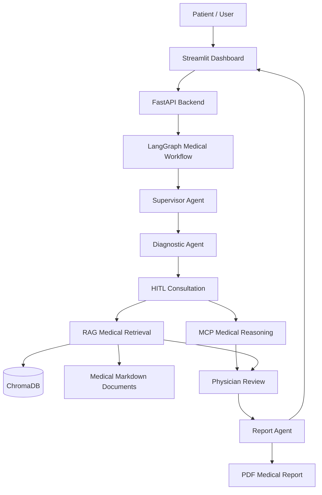
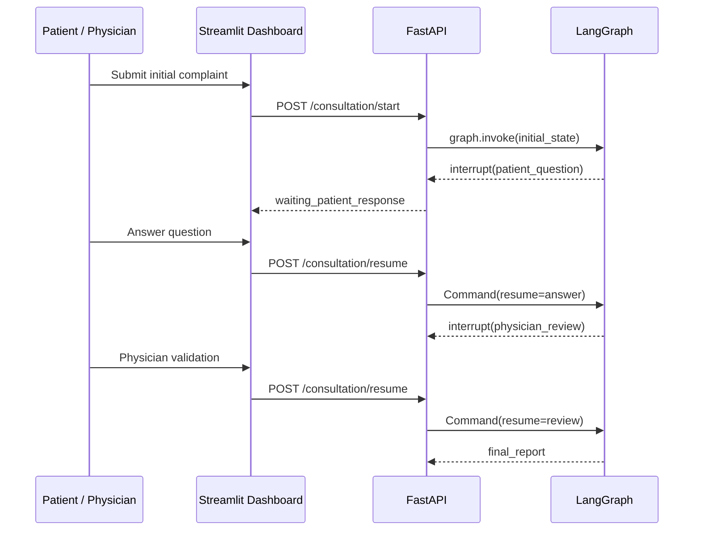
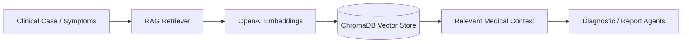

# 🩺 MediGraph AI Clinic

> **Medical Multi-Agent System with LangGraph, FastAPI, MCP and RAG**  
> Academic PFA project for preliminary clinical orientation, Human-in-the-Loop medical workflows, contextual questioning, medical retrieval and PDF report generation.


---

## ⚠️ Academic Medical Disclaimer

**MediGraph AI Clinic is not a real medical diagnostic system.**  
This project provides an **orientation clinique préliminaire** for educational and academic purposes only. It must not be used as a substitute for a licensed physician, emergency care, medical diagnosis, or treatment decision.

The system is designed around **Human-in-the-Loop safety**: patient answers and physician review steps are explicitly included before final report generation.

---

## Project Overview

**MediGraph AI Clinic** is an academic AI healthcare prototype that implements a medical multi-agent conversational workflow using **LangGraph**. It simulates a clinical consultation pipeline where specialized agents collaborate to collect patient information, ask contextual medical questions, enrich reasoning with MCP and RAG, estimate severity, request human validation, and generate a structured medical report.

The project combines:

- **LangGraph** for stateful multi-agent orchestration
- **FastAPI** for the medical workflow API
- **Streamlit** for a modern clinical dashboard
- **MCP** for medical reasoning tools
- **RAG with ChromaDB** for medical document retrieval
- **PDF export** for medical report generation

---

## Main Features

- 🧠 **LangGraph multi-agent workflow**
- 🩺 **Preliminary clinical orientation**
- 🔁 **Human-in-the-Loop workflow with interrupt/resume**
- ❓ **Dynamic contextual medical questions**
- 📊 **Clinical scoring and severity estimation**
- 🔎 **Contextual symptom extraction**
- 🧩 **MCP medical reasoning**
- 📚 **RAG medical retrieval with ChromaDB**
- 🧾 **PDF medical report export**
- 🧑‍⚕️ **Physician review step before finalization**
- 🕒 **Clinical timeline and consultation tracking**
- 🧠 **Medical memory/context tracking**
- 💻 **FastAPI backend**
- 📈 **Modern Streamlit medical dashboard**
- 🗂️ **Support for multiple clinical categories**

---

## System Architecture



### Main Pipeline

```text
Supervisor
   ↓
Diagnostic Agent
   ↓
HITL Consultation
   ↓
MCP / RAG Enrichment
   ↓
Physician Review
   ↓
Report Agent
   ↓
PDF Export + Dashboard Summary
```

---

## Multi-Agent Workflow

The project uses a stateful **LangGraph** workflow where each node is responsible for a specific clinical task.

| Agent / Node | Responsibility |
|---|---|
| **Supervisor** | Controls the workflow, routes execution, and decides the next medical step. |
| **Diagnostic Agent** | Extracts symptoms, identifies medical category, generates contextual questions, and builds a diagnostic summary. |
| **HITL Consultation** | Pauses the graph to collect human input from patient or physician. |
| **MCP/RAG Layer** | Enriches clinical reasoning using tool-based medical logic and document retrieval. |
| **Physician Review** | Simulates or requests clinical validation before report generation. |
| **Report Agent** | Generates a structured final medical report. |

The workflow state tracks:

- Patient case
- Symptoms
- Medical history
- Asked questions
- Patient responses
- Clinical category
- Clinical score
- Severity level
- MCP context
- RAG context
- Physician treatment/review
- Final report

---

## HITL Workflow

Human-in-the-Loop is a key safety mechanism in MediGraph AI Clinic.

LangGraph can pause execution using `interrupt()` and resume using `Command(resume=...)`. This allows the system to wait for:

- Patient answers to contextual questions
- Additional symptom details
- Physician review
- Treatment validation
- Final approval before report generation



---

## MCP and RAG

### MCP Medical Reasoning

The project includes an MCP-oriented reasoning layer for structured medical assistance. MCP tools can help the workflow evaluate:

- Red flags
- Urgency indicators
- Care orientation
- Symptom consistency
- Medical reasoning context

Relevant files:

- `backend/app/tools/mcp_client.py`
- `backend/mcp_server/server.py`
- `backend/app/tools/care_tools.py`
- `backend/app/tools/patient_tools.py`

### RAG Medical Retrieval

RAG retrieves contextual medical knowledge from local Markdown documents indexed into **ChromaDB** using OpenAI embeddings.



Relevant files:

- `backend/app/rag/index_documents.py`
- `backend/app/rag/retriever.py`
- `data/medical_docs/`
- `data/chroma_db/`

---

## Medical Categories Supported

MediGraph AI Clinic supports preliminary orientation across the following categories:

| Category | Examples |
|---|---|
| **Cardiac** | Chest pain, palpitations, dyspnea with cardiac suspicion |
| **Respiratory** | Cough, shortness of breath, asthma-like symptoms |
| **Digestive** | Abdominal pain, nausea, vomiting, diarrhea |
| **Infectious / Febrile** | Fever, chills, infectious syndrome |
| **Neurological** | Headache, dizziness, weakness, altered sensation |
| **ORL** | Ear, nose and throat symptoms |
| **Urinary** | Dysuria, urinary frequency, flank pain |
| **Dermatological** | Rash, skin lesions, itching |
| **Musculoskeletal** | Joint pain, back pain, trauma-like symptoms |
| **General** | Fatigue, malaise, nonspecific complaints |

---

## Folder Structure

```text
medical-multiagents-project/
├── backend/
│   ├── app/
│   │   ├── api.py                    # FastAPI application and endpoints
│   │   ├── graph.py                  # LangGraph workflow definition
│   │   ├── schemas.py                # Pydantic request/response schemas
│   │   ├── state.py                  # Medical workflow state
│   │   ├── nodes/
│   │   │   ├── supervisor.py         # Supervisor agent
│   │   │   ├── diagnostic_agent.py   # Diagnostic reasoning node
│   │   │   ├── physician_review.py   # Physician validation node
│   │   │   └── report_agent.py       # Final report generation node
│   │   ├── rag/
│   │   │   ├── index_documents.py    # Medical document indexing
│   │   │   └── retriever.py          # ChromaDB retrieval logic
│   │   ├── services/
│   │   │   ├── clinical_scoring.py   # Severity and clinical scoring
│   │   │   ├── patient_memory.py     # Patient memory/history
│   │   │   ├── pdf_export.py         # PDF report generation
│   │   │   ├── safety.py             # Input validation and safety rules
│   │   │   ├── monitoring.py         # Monitoring utilities
│   │   │   ├── performance.py        # Performance helpers
│   │   │   └── rag_mcp_optimizer.py  # RAG/MCP optimization layer
│   │   └── tools/
│   │       ├── mcp_client.py          # MCP client integration
│   │       ├── care_tools.py          # Medical care helper tools
│   │       └── patient_tools.py       # Patient context tools
│   └── mcp_server/
│       └── server.py                  # MCP server
├── data/
│   ├── medical_docs/                  # Medical knowledge base documents
│   └── chroma_db/                     # ChromaDB persistent vector store
├── frontend/
│   └── app.py                         # Streamlit dashboard
├── langgraph.json                     # LangGraph Studio configuration
├── main.py                            # Local application entry point
├── pyproject.toml                     # Project metadata and dependencies
├── requirements.txt
└── README.md
```

---

## Backend Architecture

The backend is built with **FastAPI** and exposes a workflow-first API around LangGraph.

### Core responsibilities

- Create and track consultation sessions
- Start LangGraph workflows
- Resume interrupted workflows
- Return consultation state
- Return final report
- Export report as PDF
- Provide patient history
- Validate patient input
- Expose health and integration status

### Backend components

| Component | Description |
|---|---|
| `api.py` | HTTP API, workflow orchestration, interrupt/resume handling |
| `graph.py` | LangGraph nodes, edges and checkpointer |
| `state.py` | Shared medical state contract |
| `schemas.py` | Pydantic validation models |
| `nodes/` | Agent implementations |
| `services/` | Scoring, safety, memory, monitoring, PDF export |
| `rag/` | RAG indexing and retrieval |
| `tools/` | MCP and patient/care tools |

---

## Frontend Architecture

The frontend is a **Streamlit clinical dashboard** designed for local academic demonstration.

### Dashboard capabilities

- Start a new consultation session
- Submit patient symptoms and medical history
- Display current workflow status
- Answer patient questions generated by the graph
- Resume HITL workflow
- Display clinical timeline
- Show severity and medical category
- Display final report
- Export report as PDF
- Check backend health

Relevant file:

```text
frontend/app.py
```

---

## FastAPI Endpoints

| Method | Endpoint | Description |
|---|---|---|
| `GET` | `/health` | Service health, graph status and integration readiness |
| `POST` | `/sessions/start` | Create a consultation session/thread |
| `POST` | `/consultation/start` | Start the full LangGraph consultation workflow |
| `POST` | `/consultation/resume` | Resume a paused HITL workflow |
| `GET` | `/consultation/{thread_id}` | Get current workflow state |
| `GET` | `/consultation/{thread_id}/report` | Get final generated report |
| `POST` | `/chat` | Backward-compatible consultation start |
| `POST` | `/diagnosis` | Backward-compatible diagnosis endpoint |
| `POST` | `/resume` | Backward-compatible resume endpoint |
| `GET` | `/report/{thread_id}` | Backward-compatible report endpoint |
| `POST` | `/export/pdf` | Export final report as PDF |
| `GET` | `/history?patient_id=P001` | Get patient history |
| `GET` | `/patient/{patient_id}` | Get patient profile/history |

### API Example: Health Check

```bash
curl http://127.0.0.1:8000/health
```

### API Example: Start Session

```bash
curl -X POST http://127.0.0.1:8000/sessions/start \
  -H "Content-Type: application/json" \
  -d '{
    "patient_id": "P001",
    "patient_name": "Patient test"
  }'
```

### API Example: Start Consultation

```bash
curl -X POST http://127.0.0.1:8000/consultation/start \
  -H "Content-Type: application/json" \
  -d '{
    "patient_id": "P001",
    "patient_name": "Patient test",
    "session_id": "your-thread-id",
    "patient_case": "Patient reports fever, sore throat and fatigue for 2 days.",
    "symptoms": ["fever", "sore throat", "fatigue"],
    "medical_history": ["No known chronic disease"]
  }'
```

### API Example: Resume HITL Consultation

```bash
curl -X POST http://127.0.0.1:8000/consultation/resume \
  -H "Content-Type: application/json" \
  -d '{
    "thread_id": "your-thread-id",
    "resume": {
      "answer": "Temperature is 38.7°C, no breathing difficulty, symptoms started yesterday."
    }
  }'
```

### API Example: Export PDF

```bash
curl -X POST http://127.0.0.1:8000/export/pdf \
  -H "Content-Type: application/json" \
  -o rapport-medical.pdf \
  -d '{
    "final_report": "# Preliminary Medical Report\n\nClinical orientation only.",
    "severity_level": "moderate"
  }'
```

---

## Installation

### 1. Clone the repository

```bash
git clone https://github.com/your-username/medical-multiagents-project.git
cd medical-multiagents-project
```

### 2. Create a virtual environment

```bash
python -m venv .venv
```

Activate it:

```bash
# Windows PowerShell
.\.venv\Scripts\Activate.ps1

# macOS / Linux
source .venv/bin/activate
```

### 3. Install dependencies

Using `uv`:

```bash
uv sync
```

Or using `pip`:

```bash
pip install -e .
```

### 4. Configure environment variables

Create a `.env` file at the project root:

```env
OPENAI_API_KEY=your_openai_api_key
LANGSMITH_TRACING=false
LANGSMITH_API_KEY=your_langsmith_key_optional
LANGSMITH_PROJECT=medigraph-ai-clinic
MEDICAL_SIMULATION_MODE=false
FRONTEND_ORIGINS=http://localhost:8501,http://127.0.0.1:8501
LOG_LEVEL=INFO
```

---

## Environment Variables

| Variable | Required | Description |
|---|---:|---|
| `OPENAI_API_KEY` | Yes | Required for OpenAI embeddings and LLM-based components. |
| `LANGSMITH_TRACING` | No | Enable/disable LangSmith tracing. |
| `LANGSMITH_API_KEY` | No | LangSmith API key if tracing is enabled. |
| `LANGSMITH_PROJECT` | No | LangSmith project name. |
| `MEDICAL_SIMULATION_MODE` | No | Enables simplified/simulated execution for demos. |
| `FRONTEND_ORIGINS` | No | Comma-separated CORS origins for frontend clients. |
| `LOG_LEVEL` | No | Backend logging level. |

---

## Launch Instructions

### Start the FastAPI backend

```bash
uvicorn backend.app.api:app --reload --host 127.0.0.1 --port 8000
```

API documentation will be available at:

```text
http://127.0.0.1:8000/docs
```

### Start the Streamlit dashboard

Open a second terminal:

```bash
streamlit run frontend/app.py
```

Dashboard URL:

```text
http://localhost:8501
```

### Optional: Index RAG medical documents

```bash
python -m backend.app.rag.index_documents
```

---

## LangGraph Studio Usage

The repository includes `langgraph.json`:

```json
{
  "dependencies": ["."],
  "graphs": {
    "medical_workflow": "backend.app.graph:graph"
  }
}
```

Start LangGraph Studio locally:

```bash
langgraph dev
```

Then open the Studio URL printed in the terminal and select:

```text
medical_workflow
```

LangGraph Studio is useful for:

- Visualizing graph nodes and transitions
- Inspecting state between agents
- Debugging interrupt/resume behavior
- Testing supervisor routing
- Reviewing agent outputs step by step

---

## Streamlit Dashboard Usage

1. Start the FastAPI backend.
2. Start the Streamlit dashboard.
3. Verify the backend health from the sidebar.
4. Create or reuse a patient ID.
5. Enter the patient complaint and optional medical history.
6. Start the consultation.
7. Answer generated clinical questions.
8. Continue the HITL workflow until physician review.
9. Generate the final preliminary report.
10. Export the report as PDF.

---

## Example Workflow

```text
Patient complaint:
"I have fever, throat pain, headache and fatigue since yesterday."

↓

Diagnostic Agent:
- Extracts symptoms
- Identifies probable infectious/febrile or ORL category
- Generates contextual questions

↓

HITL:
- Asks about temperature, duration, breathing difficulty, swallowing pain
- Waits for patient response

↓

MCP/RAG:
- Retrieves relevant medical context
- Checks urgency indicators
- Adds care orientation

↓

Physician Review:
- Reviews generated clinical summary
- Validates or adjusts orientation

↓

Report Agent:
- Generates structured report
- Exports PDF
```

---

## Example Consultation

### Input

```json
{
  "patient_id": "P001",
  "patient_name": "Patient test",
  "patient_case": "I have fever, sore throat and fatigue for 2 days.",
  "symptoms": ["fever", "sore throat", "fatigue"],
  "medical_history": ["No known allergies"]
}
```

### Possible generated question

```text
What is your measured temperature, and do you have difficulty breathing or swallowing?
```

### Possible patient response

```json
{
  "answer": "My temperature is 38.5°C. I can swallow, but it is painful. I do not have breathing difficulty."
}
```

### Possible preliminary orientation

```text
Clinical category: ORL / Infectious-Febrile
Severity level: Low to moderate
Orientation: Non-emergency medical consultation recommended if symptoms persist, worsen, or red flags appear.
```

---

## Example Report Generation

The final report can include:

- Patient identity/session metadata
- Initial complaint
- Extracted symptoms
- Contextual answers
- Medical category
- Clinical score
- Severity level
- RAG context summary
- MCP reasoning summary
- Physician review
- Preliminary orientation
- Safety warnings
- Recommended next steps

Example report structure:

```markdown
# Preliminary Medical Orientation Report

## Patient Summary
Patient reports fever, sore throat and fatigue for 2 days.

## Extracted Symptoms
- Fever
- Sore throat
- Fatigue

## Clinical Category
ORL / Infectious-Febrile

## Severity Estimation
Moderate

## Preliminary Orientation
This report provides orientation clinique préliminaire only.

## Safety Notice
Seek urgent care if breathing difficulty, chest pain, confusion, severe dehydration,
neurological deficit, or rapidly worsening symptoms occur.
```

---

## RAG Medical Documents

Medical knowledge files are stored in:

```text
data/medical_docs/
```

Current document categories include:

```text
cardiaque.md
respiratoire.md
digestif.md
infectieux_febrile.md
neurologique.md
orl.md
urinaire.md
dermatologique.md
musculo_articulaire.md
general.md
```

These files are indexed into ChromaDB and retrieved during the consultation to provide contextual grounding. The retrieval layer is intended to support academic demonstrations of medical RAG, not production clinical decision-making.

---

## Screenshots

Add your project screenshots in a future `docs/screenshots/` folder.

### Dashboard Home


### HITL Consultation


### Clinical Timeline


### PDF Report


---

## Challenges and Improvements

### Key challenges

- Designing a safe Human-in-the-Loop workflow for medical conversations
- Managing state across multiple agents and interrupt/resume events
- Generating useful contextual questions without overclaiming diagnosis
- Combining MCP tool reasoning with RAG retrieval
- Maintaining patient context and consultation timeline
- Producing structured reports from partial and evolving clinical information
- Separating educational clinical orientation from real medical diagnosis

### Current improvements implemented

- Workflow state centralization through LangGraph
- Clear FastAPI session/thread management
- Patient and physician HITL checkpoints
- ChromaDB-backed local medical retrieval
- Clinical scoring and severity estimation services
- PDF export workflow
- Streamlit dashboard for academic demonstration

---

## Future Improvements

- Add persistent database storage with PostgreSQL or MongoDB
- Add authentication and role-based access for patient/physician views
- Add automated test coverage for workflow nodes and API endpoints
- Add Docker and Docker Compose deployment
- Add multilingual consultation support
- Add better medical ontology mapping
- Add richer red-flag detection rules
- Add model evaluation and hallucination monitoring
- Add audit logs for HITL decisions
- Add structured FHIR-compatible export
- Add production observability with OpenTelemetry
- Add secure document upload and retrieval

---

## Safety Principles

MediGraph AI Clinic follows these academic safety principles:

- Never claim to provide a definitive diagnosis
- Always frame outputs as preliminary clinical orientation
- Keep a physician review step in the workflow
- Preserve Human-in-the-Loop checkpoints
- Include warning signs and emergency escalation advice
- Use RAG context as support, not authority
- Keep educational and academic purpose explicit

---

## Authors and Credits

**Project:** MediGraph AI Clinic – Medical Multi-Agent System with LangGraph  
**Type:** Academic PFA project  
**Domain:** AI in healthcare, medical multi-agent systems, RAG, HITL workflows  

Built with:

- [LangGraph](https://www.langchain.com/langgraph)
- [LangChain](https://www.langchain.com/)
- [FastAPI](https://fastapi.tiangolo.com/)
- [Streamlit](https://streamlit.io/)
- [ChromaDB](https://www.trychroma.com/)
- [OpenAI](https://openai.com/)
- [Pydantic](https://docs.pydantic.dev/)
- [Uvicorn](https://www.uvicorn.org/)

---

## License

This project is provided for academic and educational use.  
Add your chosen license in a `LICENSE` file, for example:

- MIT License
- Apache License 2.0
- Creative Commons for academic distribution

---

## Final Note

**MediGraph AI Clinic is a research and academic prototype.**  
It demonstrates how multi-agent AI, LangGraph, MCP, RAG and HITL workflows can be combined for medical education and preliminary clinical orientation. It is **not** approved, validated, certified, or intended for real-world medical diagnosis or treatment.
