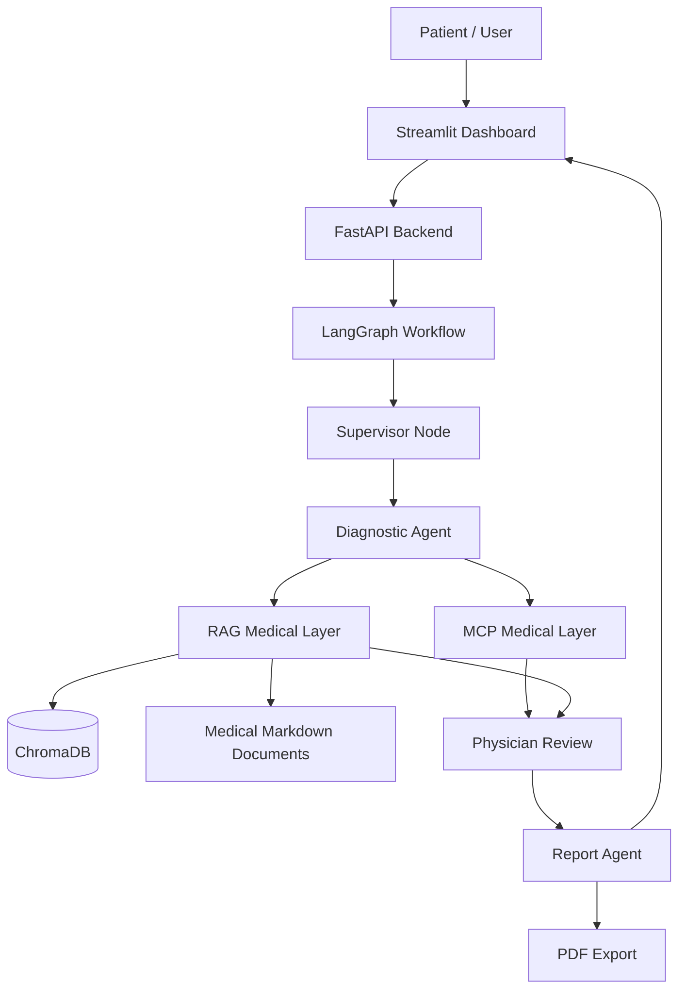

# Medical Multi-Agent System with LangGraph

> Professional project report and technical documentation for a medical multi-agent consultation system using LangGraph, FastAPI, Streamlit, MCP, RAG, and Human-in-the-Loop validation.


## Table of Contents

- [1. Executive Summary](#1-executive-summary)
- [2. Medical Disclaimer](#2-medical-disclaimer)
- [3. Project Context](#3-project-context)
- [4. Problem Statement](#4-problem-statement)
- [5. Project Objectives](#5-project-objectives)
- [6. Functional Scope](#6-functional-scope)
- [7. Global Architecture](#7-global-architecture)
- [8. Multi-Agent Workflow](#8-multi-agent-workflow)
- [9. Human-in-the-Loop Mechanism](#9-human-in-the-loop-mechanism)
- [10. MCP Medical Layer](#10-mcp-medical-layer)
- [11. RAG Medical Layer](#11-rag-medical-layer)
- [12. Technology Stack](#12-technology-stack)
- [13. Project Structure](#13-project-structure)
- [14. Installation](#14-installation)
- [15. Configuration](#15-configuration)
- [16. Running the Application](#16-running-the-application)
- [17. User Guide](#17-user-guide)
- [18. API Documentation](#18-api-documentation)
- [19. Testing and Validation](#19-testing-and-validation)
- [20. Results](#20-results)
- [21. Screenshots](#21-screenshots)
- [22. Limitations](#22-limitations)
- [23. Future Improvements](#23-future-improvements)
- [24. Authors](#24-authors)

## 1. Executive Summary

The **Medical Multi-Agent System with LangGraph** is an academic software engineering project designed to demonstrate how multi-agent artificial intelligence can support a structured medical consultation workflow.

The system allows a user to start an interactive consultation from a Streamlit dashboard. The request is sent to a FastAPI backend, which triggers a LangGraph workflow composed of multiple specialized agents. The workflow collects patient information, analyzes symptoms, retrieves medical context, requests human validation, and generates a final preliminary clinical report that can be exported as a PDF.

The project combines four important AI engineering concepts:

- **Multi-agent orchestration** with LangGraph.
- **Human-in-the-Loop safety** using workflow interruption and resumption.
- **MCP-based medical tooling** for structured support functions.
- **Retrieval-Augmented Generation** using ChromaDB and local medical documents.

The purpose of the system is not to replace a physician, but to provide a controlled academic prototype for preliminary clinical orientation and medical AI workflow experimentation.

## 2. Medical Disclaimer

This project is intended for academic and educational use only.

It does not provide:

- A definitive medical diagnosis.
- A medical prescription.
- Emergency triage.
- A replacement for physician consultation.
- Certified clinical decision support.

All generated outputs must be interpreted as **preliminary clinical orientation**. In real life, any concerning symptom, emergency sign, or worsening condition must be evaluated by a qualified healthcare professional.

## 3. Project Context

Healthcare workflows require careful collection of patient information, clinical reasoning, documentation, and human validation. Modern AI systems can assist with parts of this process, but medical applications require higher safety standards than ordinary conversational tools.

In particular, a medical AI prototype should:

- Ask relevant follow-up questions.
- Keep track of symptoms and answers.
- Identify possible red flags.
- Use external knowledge sources when possible.
- Avoid presenting uncertain reasoning as a final diagnosis.
- Include physician validation before producing a final report.

This project was developed in that context as an academic prototype combining AI agents, backend APIs, a dashboard interface, and document retrieval.

## 4. Problem Statement

Traditional chatbot-based medical assistants often suffer from three limitations:

1. They lack a clear workflow structure.
2. They may generate answers without explicit human validation.
3. They often rely only on model knowledge instead of project-specific medical documentation.

The problem addressed by this project is the design of a safer and more structured medical consultation system, where each step is controlled by a graph workflow and where human input is required before continuing sensitive stages.

The main research and engineering question is:

> How can a multi-agent LangGraph workflow be used to coordinate an interactive medical consultation with RAG, MCP tools, Human-in-the-Loop validation, and final report generation?

## 5. Project Objectives

The project has the following objectives:

- Build an interactive medical consultation interface.
- Implement a FastAPI backend for workflow execution.
- Design a LangGraph multi-agent architecture.
- Create a Diagnostic Agent for symptom analysis and clinical orientation.
- Integrate Human-in-the-Loop interruptions for patient and physician input.
- Use MCP as a medical tool layer.
- Use RAG to retrieve medical context from local documents.
- Generate a structured final clinical report.
- Export the report as a PDF file.
- Provide a professional and reproducible software architecture.

## 6. Functional Scope

The system includes the following functional modules:

| Feature | Description |
|---|---|
| Interactive consultation | The patient enters symptoms, medical history, and an initial complaint through Streamlit. |
| Diagnostic Agent | Extracts symptoms, identifies clinical category, asks contextual questions, and builds preliminary reasoning. |
| Human-in-the-Loop | Pauses the workflow to wait for patient answers and physician review. |
| MCP medical tooling | Provides structured support functions for medical reasoning and patient/care tools. |
| RAG medical retrieval | Retrieves relevant context from indexed local medical documents. |
| Physician Review | Adds a validation step before the final report is generated. |
| Report Agent | Produces a structured clinical report from the consultation state. |
| PDF export | Converts the final report into a downloadable PDF document. |
| Streamlit dashboard | Provides the user interface for the academic demonstration. |
| FastAPI backend | Exposes API endpoints for sessions, consultations, resume, reports, and PDF export. |
| LangGraph workflow | Coordinates all agents and maintains state across the consultation. |

## 7. Global Architecture

The system follows a layered architecture:

```text
Patient
  -> Streamlit Dashboard
  -> FastAPI Backend
  -> LangGraph Workflow
  -> Diagnostic Agent
  -> MCP Medical Tools
  -> RAG Medical Retriever
  -> Physician Review
  -> Report Agent
  -> PDF Export
```

Architecture diagram:



### Architectural Responsibilities

| Layer | Responsibility |
|---|---|
| Streamlit | User interface, consultation form, HITL interaction, final report display. |
| FastAPI | API gateway, request validation, graph execution, report export. |
| LangGraph | Stateful orchestration of medical agents and workflow transitions. |
| Agents | Specialized reasoning nodes for diagnosis, review, and report generation. |
| MCP | Tool-based medical support layer. |
| RAG | Retrieval of relevant medical knowledge from the local document base. |
| ChromaDB | Vector database used to persist and retrieve embedded medical documents. |

## 8. Multi-Agent Workflow

The workflow is implemented in `backend/app/graph.py` using LangGraph.

The main graph sequence is:

```text
supervisor -> diagnostic_agent -> physician_review -> report_agent
```

Every node returns control to the Supervisor, which decides the next step based on the workflow state.

### Agent Roles

| Agent / Node | Role |
|---|---|
| `supervisor` | Central router. It reads the current state and decides which agent should run next. |
| `diagnostic_agent` | Performs symptom extraction, clinical category detection, contextual questioning, RAG enrichment, and preliminary reasoning. |
| `physician_review` | Represents the Human-in-the-Loop validation step before finalization. |
| `report_agent` | Produces the final structured medical report. |

### Workflow State

The workflow state stores the full consultation context, including:

- Patient case.
- Patient identifier and session identifier.
- Symptoms and medical history.
- Asked questions and patient responses.
- Clinical category.
- Clinical score.
- Severity level.
- Diagnostic summary.
- MCP context.
- RAG context.
- Physician notes and decision.
- Final report.
- PDF path.
- Consultation status.

## 9. Human-in-the-Loop Mechanism

Human-in-the-Loop is one of the most important safety mechanisms in the project.

LangGraph allows the workflow to pause execution using `interrupt()`. The backend can later resume the same workflow thread using `Command(resume=...)`.

This mechanism is used for:

- Asking the patient contextual medical questions.
- Waiting for additional symptom clarification.
- Requesting physician review.
- Preventing automatic finalization without human validation.

Conceptual flow:

```text
graph.invoke(initial_state)
  -> interrupt(patient_question)
  -> user provides answer
  -> Command(resume=patient_answer)
  -> interrupt(physician_review)
  -> physician validates or modifies orientation
  -> Command(resume=physician_decision)
  -> report_agent generates final report
```

This design makes the workflow more transparent and safer than a fully autonomous chatbot.

## 10. MCP Medical Layer

MCP is used as a structured tool layer for medical helper functions.

In this project, the MCP layer supports:

- Patient-related tools.
- Care orientation helpers.
- Medical context enrichment.
- Separation between tool logic and graph orchestration.

Relevant files:

- `backend/mcp_server/server.py`
- `backend/app/tools/mcp_client.py`
- `backend/app/tools/care_tools.py`
- `backend/app/tools/patient_tools.py`

The MCP layer improves modularity because new medical tools can be added without rewriting the full LangGraph workflow.

## 11. RAG Medical Layer

The Retrieval-Augmented Generation module retrieves medical information from local Markdown documents stored in `data/medical_docs/`.

The RAG pipeline works as follows:

```text
Medical documents
  -> document indexing
  -> embeddings
  -> ChromaDB vector store
  -> similarity retrieval
  -> relevant medical context
  -> agent reasoning
```

RAG is useful because it:

- Grounds the agents in a local medical knowledge base.
- Reduces dependence on the LLM alone.
- Retrieves information based on symptoms and clinical category.
- Supports final report generation with contextual information.

Relevant files:

- `backend/app/rag/index_documents.py`
- `backend/app/rag/retriever.py`
- `data/medical_docs/`
- `data/chroma_db/`

Current medical document categories include:

- Cardiac.
- Respiratory.
- Digestive.
- Infectious / febrile.
- Neurological.
- ENT / ORL.
- Urinary.
- Dermatological.
- Musculoskeletal.
- General medicine.

## 12. Technology Stack

| Technology | Role in the Project |
|---|---|
| Python | Main programming language. |
| FastAPI | Backend API framework. |
| Streamlit | Interactive dashboard and user interface. |
| LangGraph | Multi-agent workflow orchestration. |
| LangChain | LLM integration and supporting AI abstractions. |
| OpenAI | LLM and embedding provider. |
| ChromaDB | Vector database for RAG. |
| MCP / FastMCP | Tool protocol and medical helper layer. |
| Pydantic | Data validation and API schemas. |
| Uvicorn | ASGI server for FastAPI. |
| ReportLab | PDF generation. |
| python-dotenv | Environment variable loading. |

## 13. Project Structure

```text
medical-multiagents-project/
|-- backend/
|   |-- __init__.py
|   |-- app/
|   |   |-- __init__.py
|   |   |-- api.py                    # FastAPI application and HTTP endpoints
|   |   |-- graph.py                  # LangGraph workflow definition
|   |   |-- schemas.py                # Pydantic schemas
|   |   |-- state.py                  # Medical workflow state
|   |   |-- nodes/
|   |   |   |-- __init__.py
|   |   |   |-- supervisor.py          # Workflow router
|   |   |   |-- diagnostic_agent.py    # Diagnostic reasoning agent
|   |   |   |-- physician_review.py    # Physician validation node
|   |   |   `-- report_agent.py        # Final report generation agent
|   |   |-- rag/
|   |   |   |-- __init__.py
|   |   |   |-- index_documents.py     # Medical document indexing
|   |   |   |-- retriever.py           # Medical context retrieval
|   |   |   `-- medical_docs/README.md
|   |   |-- services/
|   |   |   |-- __init__.py
|   |   |   |-- clinical_scoring.py    # Severity and clinical score helpers
|   |   |   |-- hitl_cache.py          # HITL state support
|   |   |   |-- monitoring.py          # Monitoring utilities
|   |   |   |-- patient_memory.py      # Patient history and memory
|   |   |   |-- pdf_export.py          # PDF report generation
|   |   |   |-- performance.py         # Performance measurement helpers
|   |   |   `-- safety.py             # Input validation and safety checks
|   |   `-- tools/
|   |       |-- __init__.py
|   |       |-- care_tools.py          # Care orientation tools
|   |       |-- mcp_client.py          # MCP client
|   |       `-- patient_tools.py       # Patient helper tools
|   `-- mcp_server/
|       |-- __init__.py
|       `-- server.py                 # MCP server
|-- data/
|   |-- medical_docs/                 # Medical knowledge base
|   |   |-- README.md
|   |   |-- cardiaque.md
|   |   |-- dermatologique.md
|   |   |-- digestif.md
|   |   |-- general.md
|   |   |-- infectieux_febrile.md
|   |   |-- musculo_articulaire.md
|   |   |-- neurologique.md
|   |   |-- orl.md
|   |   |-- respiratoire.md
|   |   `-- urinaire.md
|   `-- chroma_db/                    # Persistent ChromaDB database
|-- frontend/
|   `-- app.py                        # Streamlit dashboard
|-- langgraph.json                    # LangGraph Studio configuration
|-- main.py                           # Local entry point
|-- pyproject.toml                    # Project metadata and dependencies
|-- requirements.txt                  # Optional dependency file
|-- uv.lock                           # uv lock file
`-- README.md
```

## 14. Installation

### Step 1: Clone the Repository

```bash
git clone https://github.com/your-username/medical-multiagents-project.git
cd medical-multiagents-project
```

### Step 2: Create a Virtual Environment

```bash
python -m venv .venv
```

Activate the environment:

```bash
# Windows PowerShell
.\.venv\Scripts\Activate.ps1

# macOS / Linux
source .venv/bin/activate
```

### Step 3: Install Dependencies

Using `uv`:

```bash
uv sync
```

Using `pip`:

```bash
pip install -e .
```

## 15. Configuration

Create a `.env` file at the project root.

Example:

```env
OPENAI_API_KEY=your_openai_api_key
LANGSMITH_API_KEY=your_langsmith_api_key
LANGSMITH_TRACING=false
LANGSMITH_PROJECT=medical-multi-agent-system

FRONTEND_ORIGINS=http://localhost:8501,http://127.0.0.1:8501
LOG_LEVEL=INFO
RAG_EMBEDDING_MODE=openai
MEDICAL_DOCS_DIR=data/medical_docs
CHROMA_PERSIST_DIR=data/chroma_db
```

| Variable | Required | Description |
|---|---:|---|
| `OPENAI_API_KEY` | Yes | Required for OpenAI LLM and embedding features. |
| `LANGSMITH_API_KEY` | Optional | Required only if LangSmith tracing is enabled. |
| `LANGSMITH_TRACING` | Optional | Enables or disables LangSmith tracing. |
| `LANGSMITH_PROJECT` | Optional | LangSmith project name. |
| `FRONTEND_ORIGINS` | Optional | Allowed frontend origins for CORS. |
| `LOG_LEVEL` | Optional | Backend logging level. |
| `RAG_EMBEDDING_MODE` | Optional | Embedding mode for RAG. |
| `MEDICAL_DOCS_DIR` | Optional | Path to medical Markdown documents. |
| `CHROMA_PERSIST_DIR` | Optional | Path to ChromaDB persistent storage. |

## 16. Running the Application

### Start the Backend

```bash
uvicorn backend.app.api:app --reload
```

Backend URL:

```text
http://127.0.0.1:8000
```

Swagger documentation:

```text
http://127.0.0.1:8000/docs
```

### Start the Frontend

In a second terminal:

```bash
streamlit run frontend/app.py
```

Frontend URL:

```text
http://localhost:8501
```

### Rebuild the RAG Index

Run this command if the medical documents are changed:

```bash
python -m backend.app.rag.index_documents
```

## 17. User Guide

A complete consultation follows these steps:

1. Launch the FastAPI backend.
2. Launch the Streamlit frontend.
3. Open the dashboard in the browser.
4. Enter patient information.
5. Enter the main complaint and symptoms.
6. Add medical history if available.
7. Start the consultation.
8. Wait for the Diagnostic Agent to analyze the case.
9. Answer the contextual medical questions.
10. Continue the workflow after each HITL interruption.
11. Review or validate the physician step.
12. Generate the final report.
13. Export the report as PDF.

Example patient case:

```text
Patient reports fever, sore throat, fatigue, and headache for two days.
```

Possible system behavior:

- Detects an infectious or ENT-oriented clinical category.
- Asks about temperature, breathing difficulty, pain intensity, and symptom duration.
- Retrieves relevant medical context from RAG.
- Requests physician review.
- Generates a preliminary clinical report.

## 18. API Documentation

| Method | Endpoint | Description |
|---|---|---|
| `GET` | `/health` | Checks API status, graph readiness, and integration health. |
| `POST` | `/sessions/start` | Creates a new consultation session. |
| `POST` | `/consultation/start` | Starts a LangGraph medical consultation. |
| `POST` | `/consultation/resume` | Resumes a workflow paused by Human-in-the-Loop. |
| `GET` | `/consultation/{thread_id}` | Returns the current consultation state. |
| `GET` | `/consultation/{thread_id}/report` | Returns the final report for a consultation. |
| `POST` | `/chat` | Backward-compatible consultation endpoint. |
| `POST` | `/diagnosis` | Backward-compatible diagnostic endpoint. |
| `POST` | `/resume` | Backward-compatible resume endpoint. |
| `GET` | `/report/{thread_id}` | Backward-compatible report endpoint. |
| `POST` | `/export/pdf` | Exports a report as PDF. |
| `GET` | `/history` | Returns patient history using `patient_id`. |
| `GET` | `/patient/{patient_id}` | Returns patient profile and history. |

Example request to start a consultation:

```bash
curl -X POST http://127.0.0.1:8000/consultation/start \
  -H "Content-Type: application/json" \
  -d '{
    "patient_id": "P001",
    "patient_name": "Test Patient",
    "patient_case": "Patient reports fever, sore throat and fatigue for two days.",
    "symptoms": ["fever", "sore throat", "fatigue"],
    "medical_history": ["No known chronic disease"]
  }'
```

Example request to resume a paused workflow:

```bash
curl -X POST http://127.0.0.1:8000/consultation/resume \
  -H "Content-Type: application/json" \
  -d '{
    "thread_id": "your-thread-id",
    "resume": {
      "answer": "Temperature is 38.5 C. No breathing difficulty."
    }
  }'
```

## 19. Testing and Validation

The system was validated using representative academic scenarios.

| Test Case | Input Example | Expected Result |
|---|---|---|
| Respiratory case | Cough, fever, shortness of breath | Respiratory category, severity questions, RAG respiratory context. |
| Cardiac case | Chest pain, palpitations, dyspnea | Cardiac category, red-flag awareness, physician review. |
| Digestive case | Abdominal pain, nausea, diarrhea | Digestive category, questions about duration, dehydration, pain location. |
| Benign case | Mild fatigue or minor symptoms | Low severity orientation and monitoring advice. |

Validation criteria:

- The backend starts successfully.
- The Streamlit interface communicates with FastAPI.
- The graph starts a consultation thread.
- HITL interruptions are returned correctly.
- `Command(resume=...)` continues the workflow.
- RAG context is retrieved from local medical documents.
- A final report is generated.
- PDF export returns a downloadable document.

## 20. Results

The project successfully demonstrates:

- A working medical consultation workflow.
- A clear separation between frontend, backend, graph, tools, and retrieval layers.
- Stateful multi-agent orchestration with LangGraph.
- Human-in-the-Loop validation before finalization.
- Medical document retrieval using ChromaDB.
- Structured clinical report generation.
- PDF export for final consultation output.
- A reproducible academic prototype suitable for demonstration and extension.

The system shows that LangGraph is well suited for medical workflow prototyping because it allows explicit state management, controlled routing, and interruption points.

## 21. Screenshots

Place screenshots in `docs/screenshots/` and update the paths below.

### Dashboard Home


### Consultation Form


### Human-in-the-Loop Question


### Physician Review


### Final Report


### PDF Export


## 22. Limitations

The current system has several limitations:

- It provides preliminary clinical orientation only.
- It does not replace a doctor or emergency medical service.
- It is not clinically certified.
- It does not include production-grade authentication.
- It does not include a production database such as PostgreSQL.
- The medical knowledge base is limited to local Markdown files.
- RAG quality depends on the quality and coverage of the indexed documents.
- Patient history management is prototype-oriented.
- Security and privacy controls must be improved before any real deployment.

## 23. Future Improvements

Planned improvements include:

- PostgreSQL integration for persistent patient and consultation storage.
- Authentication and role-based access control.
- Complete patient history management.
- Cloud deployment with Docker and CI/CD.
- A richer medical document base for RAG.
- Automated tests for API endpoints and graph nodes.
- Better observability with LangSmith and OpenTelemetry.
- Improved red-flag detection.
- Multilingual support.
- Stronger audit logs for Human-in-the-Loop decisions.
- FHIR-compatible export for medical interoperability.

## 24. Authors

Academic project developed at **EMSI** in the field of **Artificial Intelligence and Data Science**.

Project theme:

```text
Medical Multi-Agent System with LangGraph
```

Main domain:

```text
AI in healthcare, multi-agent systems, Human-in-the-Loop workflows, MCP, and RAG.
```

## License

This repository is intended for academic and educational use. Add a `LICENSE` file before public distribution or open-source publication.
